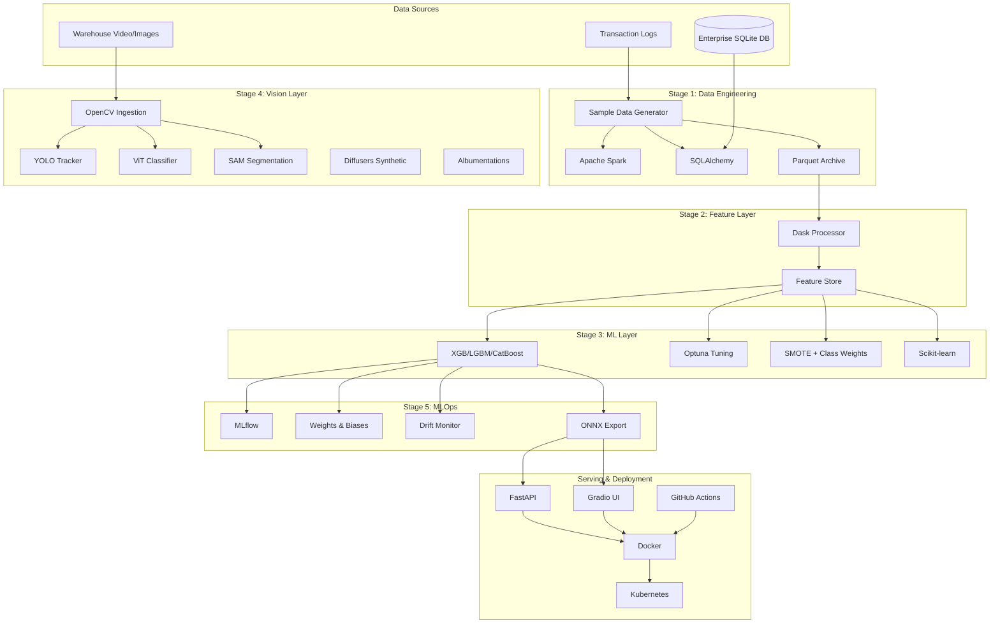

# Vision-Driven Global Supply Chain Intelligent Logistics, Automated Inventory, & Dynamic Market Forecasting

# MNC Context:
Deployed within a global manufacturing or e-commerce conglomerate. It processes continuous streaming telemetry, warehouse video feeds, and market pricing to prevent fraud, manage warehouse inventory completely via machine vision, and build predictive tabular architectures.

# Problem Statement
Engineer an enterprise intelligence engine that runs on a distributed data pipeline. The framework must ingest physical warehouse video feeds to tracks inventory assets in real-time, generate pixel-level asset masks for damage inspection, create synthetic edge-case dataset variations, extract structural labels from shipments, compile global data features into an unified repository, and execute high-performance gradient-boosted models alongside classical machine learning structures to counter class-imbalance anomalies and accurately forecast multi-million dollar pricing strategies.

# Tech Stack & Skills Covered

# Data Engineering & Processing:
Apache Spark (handling massively distributed real-time transactional logs streams), Dask (parallel python processing of sprawling arrays), NumPy (vectorized matrix computations), SQLAlchemy (interfacing with historical enterprise transactional relational databases), Parquet (efficient columnar file archiving), Feature Store (storing and serving unified, reusable predictive components).

# Classical Machine Learning:
Scikit-learn (core suite for regression, preprocessing, and metrics extraction), XGBoost, LightGBM, CatBoost (competing gradient boosting models for price optimization and supply bottlenecks), Supervised Learning (regression algorithms for future sales margins), Unsupervised Learning (K-Means/PCA for automated visual damage categorization and market clustering), Feature Engineering (handling target scaling and target encodings), Hyperparameter Tuning via Optuna (automated parameter search sweeps), K-Fold Cross-Validation (preventing temporal overfitting), Imbalanced Data (using SMOTE and adjusting class weights to manage highly sparse fraud/defect occurrences).

# Computer Vision & Audio (Visual Intelligence focus):
OpenCV (real-time high-efficiency video stream ingestion and frame-by-frame preprocessing), Pillow (PIL) (low-overhead base image transformations), YOLO (real-time object detection tracking asset pallets moving through bays), Hugging Face ViT (Vision Transformers for multi-label product classification), Diffusers (generatively fabricating rare, synthetic edge-case imagery for anomaly training sets), Image Segmentation via SAM (Segment Anything Model for precise defect/damage boundary mapping on items), Albumentations (advanced bounding-box and segmentation-aware geometric and color data augmentation transformations).

# MLOps Infrastructure:
Docker (containerizing local serving runtimes), Kubernetes (orchestrating and scaling inferential microservices globally), MLflow (tracking experiments and versioning registered models), Weights & Biases (tracking loss trajectories and visual validation outputs during training).

# Model Optimization, Edge & Deployment:
ONNX (universal model structure serialization), TensorRT (NVIDIA execution graph compilation for edge deployments on warehouse server rigs), AWS SageMaker (cloud-based multi-instance training pipelines), Gadio (interactive web-UI sandboxes for field QA testing), CI/CD for ML (GitHub Actions pipelines checking data sanity, running formatting unit tests, and triggering Docker builds), Model Drift(continuous evaluation monitors detecting data/prediction shifts post-deployment).

# Vision-Driven Global Supply Chain Intelligence — Full Architecture Summary

This document describes the entire codebase: what was built, how components connect, and how data flows from ingestion through ML, computer vision, MLOps, and serving.
---

## 1. High-Level Purpose

The platform is an **enterprise intelligence engine** for a global manufacturing/e-commerce conglomerate. It:

- Ingests **transactional logs**, **warehouse video**, and **market data**
- Tracks inventory and inspects damage via **computer vision**
- Builds **predictive models** for pricing and fraud
- Monitors **model drift** after deployment
- Exposes results through **APIs, Gradio UI, Docker, and Kubernetes**

Everything is orchestrated by a single master pipeline (`run_pipeline.py`) and can be re-run with output export via `export_pipeline_outputs.py`.

---

## 2. System Architecture (Bird’s-Eye View)



---

## 3. Project Structure

```
Project-4/
├── config/settings.yaml          # Central configuration
├── run_pipeline.py               # 5-stage orchestrator
├── export_pipeline_outputs.py    # Run + export text/charts/visuals to root
│
├── src/
│   ├── data/                     # Sample/synthetic data generation
│   ├── data_engineering/         # Spark, Dask, SQLAlchemy, Parquet
│   ├── feature_store/            # Unified feature repository
│   ├── ml_models/                # Classical ML + gradient boosting
│   ├── computer_vision/          # Video, YOLO, ViT, SAM, Diffusers
│   ├── mlops/                    # MLflow, W&B, drift, ONNX
│   ├── serving/                  # Gradio + FastAPI
│   └── utils/                    # Config loader
│
├── data/                         # Runtime data (raw, processed, synthetic)
├── models/                       # Trained models (.pkl, .onnx)
├── mlflow.db                     # MLflow experiment tracking (SQLite)
│
├── Dockerfile / Dockerfile.api / Dockerfile.gradio
├── docker-compose.yml            # Multi-service local deployment
├── k8s/deployment.yaml           # Kubernetes manifests
├── .github/workflows/ci-cd.yml   # CI/CD pipeline
├── tests/                        # Unit tests (10 tests)
│
└── Root outputs (after export):
    ├── PIPELINE_REPORT.json / .txt / PIPELINE_SUMMARY.txt
    ├── pipeline_chart_outputs/   # Matplotlib analytics charts
    └── pipeline_visual_outputs/  # Vision artifacts (31 files)
```

---

## 4. Configuration Layer

**File:** `config/settings.yaml` + `src/utils/config.py`

All paths, model names, ML hyperparameters, and serving ports are centralized. `load_config()` resolves relative paths to absolute project paths and sets MLflow to a **SQLite backend** (`sqlite:///mlflow.db`) for MLflow 3.x compatibility.

| Section | Controls |
|---------|----------|
| `paths` | Raw/processed/synthetic data, models, feature store |
| `spark` | App name, local master, checkpoint dir |
| `database` | SQLite enterprise DB URL |
| `video` | Frame size, FPS, camera IDs |
| `vision` | YOLO/ViT/SAM model IDs, confidence threshold |
| `ml` | Target column, test split, Optuna trials, SMOTE ratio |
| `mlops` | Experiment name, W&B project, drift threshold |
| `serving` | Gradio (7860) and API (8000) ports |

---

## 5. End-to-End Pipeline (5 Stages)

The class `SupplyChainPipeline` in `run_pipeline.py` runs stages sequentially and stores results in `self.results`, then writes `data/processed/pipeline_report.json`.

---

### Stage 1 — Data Ingestion & Engineering

**Goal:** Ingest transactional logs, archive to Parquet, seed enterprise DB, simulate streaming, generate warehouse media.

| Module | File | How It Works |
|--------|------|--------------|
| Sample data | `src/data/sample_data.py` | Generates 5,000 transactions across 4 regions (NA, EU, APAC, LATAM), 5 categories, with `is_fraud` (~2%) and `is_defect` (~3%). Adds engineered columns: `region_encoded`, `log_quantity`, `cost_ratio`, etc. Creates warehouse JPEG frames with bounding-box JSON metadata and an MP4 video with a moving pallet. |
| Parquet | `src/data_engineering/parquet_handler.py` | Writes columnar Parquet with optional region partitioning via PyArrow. Supports read, filter, schema inspection. |
| SQLAlchemy | `src/data_engineering/sqlalchemy_connector.py` | Seeds SQLite `enterprise.db` with `transactions` and `warehouses` tables. Supports joins, regional summaries, fraud queries, prediction writes. |
| Spark | `src/data_engineering/spark_pipeline.py` | Creates a SparkSession, aggregates regional metrics, detects price anomalies (3σ rule). On Windows, uses a **pandas fallback** when native Spark/Hadoop fails. Simulates streaming via JSON batch ingestion. |

**Outputs:** 5,000 transactions, Parquet archive, SQLite DB, 20 Spark-aggregated region×category rows, 10 images, 1 video.

---

### Stage 2 — Feature Engineering (Dask + Feature Store)

**Goal:** Parallel feature computation and unified feature storage.

| Module | File | How It Works |
|--------|------|--------------|
| Dask | `src/data_engineering/dask_processor.py` | Uses Dask arrays for parallel z-score and log transforms. Runs K-Means clustering (4 clusters) on market segments. Computes PCA via NumPy SVD on Dask-computed matrices. Produces 34 enriched features including `market_cluster`, `pca_0/1/2`. |
| Feature Store | `src/feature_store/feature_store.py` | Registers feature groups as Parquet + JSON registry. Stores transformers as joblib pickles. Can compile multiple groups into one unified DataFrame. |

**Registered groups:**
- `transaction_features` — full Dask-enriched dataset
- `market_features` — region, category, price, market_index, cluster

---

### Stage 3 — ML Training (Gradient Boosting + Optuna + SMOTE)

**Goal:** Train competing models for price forecasting and fraud detection; tune hyperparameters; handle class imbalance.

| Module | File | How It Works |
|--------|------|--------------|
| Classical ML | `src/ml_models/classical_ml.py` | `RobustScaler` preprocessing, temporal K-Fold CV (no shuffle — time-aware), K-Means/PCA for unsupervised clustering, regression/classification metrics (RMSE, MAE, R², F1, ROC-AUC). |
| Gradient Boosting | `src/ml_models/gradient_boosting.py` | Trains **XGBoost, LightGBM, CatBoost** regressors in competition; picks best by RMSE. Trains classifiers for fraud with class weights. Lazy-imports LightGBM/CatBoost with sklearn fallbacks if DLLs fail. Forecasts prices per region. |
| Imbalanced data | `src/ml_models/imbalanced_handler.py` | Computes balanced class weights; applies **SMOTE** to upsample fraud class (2% → balanced training set). |
| Optuna | `src/ml_models/hyperparameter_tuning.py` | 10-trial Bayesian search over XGBoost: `n_estimators`, `max_depth`, `learning_rate`, `subsample`, `colsample_bytree`. Uses 5-fold CV. |

**Feature columns used:** `quantity`, `unit_cost`, `shipping_days`, `market_index`, `region_encoded`, `category_encoded`, `log_quantity`, `cost_ratio`

**Tracking:**
- **MLflow** — logs params, metrics, model artifact to SQLite
- **W&B** — logs model comparison table (offline if no API key)
- Best model saved to `models/best_price_model.pkl`

**Typical results:** LightGBM wins (~RMSE 19,379), R² ~0.987, fraud F1 ~0.97.

---

### Stage 4 — Computer Vision Pipeline

**Goal:** Process warehouse video/images for inventory tracking, product classification, damage inspection, and synthetic anomaly data.

| Module | File | How It Works |
|--------|------|--------------|
| Video ingestion | `src/computer_vision/video_ingestion.py` | OpenCV reads video frame-by-frame, resizes to 640×480, converts BGR→RGB. Computes optical-flow motion vectors. Creates inventory snapshots via Canny edge detection + contour analysis. |
| YOLO tracker | `src/computer_vision/yolo_tracker.py` | Loads Ultralytics YOLOv8n; detects pallets/boxes/crates. Tracks assets across video frames. Saves annotated images. **Fallback:** OpenCV contour detection if YOLO/torch unavailable. |
| ViT classifier | `src/computer_vision/vit_classifier.py` | Hugging Face ViT for multi-label product classification (electronics, food, pharma, hazmat, fragile, etc.). `extract_shipment_labels()` returns primary category + flags. **Fallback:** color/heuristic classifier. |
| SAM segmentation | `src/computer_vision/sam_segmentation.py` | Segment Anything Model for pixel-level damage masks. `auto_detect_damage()` uses Laplacian edge detection to find damage points, then segments. Overlays red mask on image. **Fallback:** OpenCV Otsu thresholding. |
| Synthetic generator | `src/computer_vision/synthetic_generator.py` | Diffusers Stable Diffusion for rare edge cases (damaged package, hazmat leak, spill, etc.). **Fallback:** procedural Pillow drawing for 6 edge-case types × 2 images each = 12 synthetic images. |
| Augmentation | `src/computer_vision/augmentation.py` | Albumentations for bbox-aware flips, brightness, rotation, noise, elastic transforms. **Fallback:** OpenCV flip + HSV jitter. |

**Outputs:** 5 annotated images, 3 damage overlays, 12 synthetic images, 6 augmented samples, video track data.

---

### Stage 5 — MLOps, Export & Drift Monitoring

**Goal:** Monitor model health, export for deployment, prepare cloud/edge configs.

| Module | File | How It Works |
|--------|------|--------------|
| Drift monitor | `src/mlops/model_drift.py` | Stores reference feature distributions. Uses **Kolmogorov–Smirnov test** and mean-shift detection vs threshold (0.15). Monitors both feature drift and prediction drift. Generates text drift report. |
| Model export | `src/mlops/model_export.py` | Saves joblib pickle. Exports to **ONNX** via skl2onnx/onnxmltools. Validates with ONNX Runtime. Generates **TensorRT** `trtexec` command config. Generates **AWS SageMaker** deployment JSON. |
| MLflow | `src/mlops/mlflow_tracker.py` | SQLite-backed experiment tracking; logs params, metrics, model artifacts per run. |
| W&B | `src/mlops/wandb_tracker.py` | Optional online/offline experiment logging with metric tables and image logging hooks. |

---

## 6. Serving Layer

### FastAPI (`src/serving/inference_api.py`)

| Endpoint | Method | Purpose |
|----------|--------|---------|
| `/health` | GET | Service health + model loaded status |
| `/predict/price` | POST | Price forecast from 7 numeric features |
| `/analyze/image` | POST | Upload image → YOLO detections + ViT labels |
| `/metrics/summary` | GET | Service metadata |

Loads `models/best_price_model.pkl` on startup.

### Gradio (`src/serving/gradio_app.py`)

Interactive web UI on port **7860**: upload warehouse image → combined YOLO + ViT + SAM analysis with annotated output and JSON report.

---

## 7. Deployment & CI/CD

| Component | File | Purpose |
|-----------|------|---------|
| **Docker (pipeline)** | `Dockerfile` | Full pipeline container |
| **Docker (API)** | `Dockerfile.api` | FastAPI on port 8000 |
| **Docker (Gradio)** | `Dockerfile.gradio` | Gradio UI on port 7860 |
| **Docker Compose** | `docker-compose.yml` | Orchestrates pipeline + API + Gradio + MLflow server |
| **Kubernetes** | `k8s/deployment.yaml` | 3-replica API deployment, Gradio deployment, PVC for models, liveness/readiness probes |
| **GitHub Actions** | `.github/workflows/ci-cd.yml` | Data sanity checks → lint/test → Docker build → pipeline smoke test |

---

## 8. Output Export System

**File:** `export_pipeline_outputs.py`

Runs the full pipeline, then writes to project root:

| Output | Description |
|--------|-------------|
| `PIPELINE_REPORT.json` | Full structured metrics |
| `PIPELINE_REPORT.txt` | Human-readable report |
| `PIPELINE_SUMMARY.txt` | Index + key metrics |
| `pipeline_chart_outputs/` | 5 Matplotlib charts (RMSE, F1, revenue, fraud/defect, damage) |
| `pipeline_visual_outputs/` | 31 vision files (frames, annotations, damage maps, synthetic, video) |

---

## 9. Data Flow (End-to-End)

```
1. generate_transaction_logs(5000)
       ↓
2. generate_market_features() → seed SQLite → archive Parquet
       ↓
3. Spark/pandas aggregate + anomaly detection + stream simulation
       ↓
4. create_sample_images() + create_sample_video()
       ↓
5. Dask parallel features + K-Means + PCA → Feature Store
       ↓
6. SMOTE fraud data → train XGB/LGBM/CatBoost → Optuna tune → MLflow log
       ↓
7. OpenCV ingest → YOLO track → ViT classify → SAM damage → Diffusers synth → Albumentations augment
       ↓
8. Drift check → ONNX export → TensorRT/SageMaker configs
       ↓
9. Save models + reports + export charts/visuals to root
```

State is passed between stages via instance attributes on `SupplyChainPipeline`:
- `_df` → raw enriched transactions
- `_enriched_df` → Dask-processed features
- `_image_paths`, `_video_path` → vision inputs
- `_gbm`, `_best_model` → trained ML artifacts

---

## 10. Resilience & Fallback Design

The codebase is built to run on varied environments (including Windows without GPU):

| Component | Primary | Fallback |
|-----------|---------|----------|
| Spark | Native Spark SQL | Pandas batch/stream processing |
| LightGBM/CatBoost | Native DLLs | Sklearn GBM / RandomForest |
| YOLO | Ultralytics + PyTorch | OpenCV contour detection |
| ViT | Hugging Face Transformers | Color/heuristic classifier |
| SAM | Facebook SAM weights | OpenCV Otsu segmentation |
| Diffusers | Stable Diffusion | Procedural Pillow images |
| Albumentations | Full augmentation pipeline | OpenCV flip + HSV jitter |
| W&B | Online logging | Offline/disabled mode |
| ONNX | Model conversion + validation | Graceful error capture |

---

## 11. Testing

**File:** `tests/test_pipeline.py` — **10 passing tests**

Covers: config loading, sample data generation, Parquet R/W, Feature Store register/retrieve, classical ML metrics, K-Means clustering, SMOTE class weights, drift detection.

---

## 12. Tech Stack Mapping (Problem Statement → Implementation)

| Required Tech | Implementation Location |
|---------------|------------------------|
| Apache Spark | `spark_pipeline.py` |
| Dask | `dask_processor.py` |
| NumPy | Used throughout (Dask, ML, vision) |
| SQLAlchemy | `sqlalchemy_connector.py` |
| Parquet | `parquet_handler.py` |
| Feature Store | `feature_store.py` |
| Scikit-learn | `classical_ml.py` |
| XGBoost / LightGBM / CatBoost | `gradient_boosting.py` |
| Optuna | `hyperparameter_tuning.py` |
| SMOTE | `imbalanced_handler.py` |
| K-Fold CV | `classical_ml.py` (temporal, no shuffle) |
| OpenCV | `video_ingestion.py`, vision fallbacks |
| Pillow | `sample_data.py`, `synthetic_generator.py` |
| YOLO | `yolo_tracker.py` |
| Hugging Face ViT | `vit_classifier.py` |
| Diffusers | `synthetic_generator.py` |
| SAM | `sam_segmentation.py` |
| Albumentations | `augmentation.py` |
| MLflow | `mlflow_tracker.py` |
| W&B | `wandb_tracker.py` |
| Docker / K8s | `Dockerfile*`, `docker-compose.yml`, `k8s/` |
| ONNX / TensorRT | `model_export.py` |
| SageMaker | `model_export.py` (config) |
| Gradio | `gradio_app.py` |
| FastAPI | `inference_api.py` |
| CI/CD | `.github/workflows/ci-cd.yml` |
| Model Drift | `model_drift.py` |

---

## 13. How to Operate the System

```bash
# Full pipeline
python run_pipeline.py

# Pipeline + export all outputs to root
python export_pipeline_outputs.py

# Interactive vision QA
python src/serving/gradio_app.py

# REST API
uvicorn src.serving.inference_api:app --port 8000

# Tests
python -m pytest tests/ -v

# Docker (all services)
docker-compose up --build

# Kubernetes
kubectl apply -f k8s/deployment.yaml
```

---

## 14. Summary

This is a **modular, 5-stage ML platform** that mirrors an enterprise supply chain intelligence stack:

1. **Ingest** transactional + visual data through Spark, SQL, and Parquet  
2. **Engineer** features in parallel with Dask and store them in a Feature Store  
3. **Train** competing gradient-boosted models with Optuna tuning and SMOTE for fraud  
4. **Analyze** warehouse media with YOLO, ViT, SAM, and synthetic data generation  
5. **Deploy** with drift monitoring, ONNX export, and serving via API/Gradio/Docker/K8s  

The architecture is **orchestrator-driven** (`SupplyChainPipeline`), **config-driven** (`settings.yaml`), and **resilient** (fallbacks at every heavy dependency). All stages have been verified running end-to-end on your machine, with textual and visual outputs saved to the project root.


# Vision-Driven Global Supply Chain Intelligent Logistics

Enterprise intelligence engine for global manufacturing/e-commerce conglomerates. Processes streaming telemetry, warehouse video feeds, and market pricing to prevent fraud, manage inventory via machine vision, and forecast multi-million dollar pricing strategies.

## Architecture

```
┌─────────────────────────────────────────────────────────────────────┐
│                    SUPPLY CHAIN INTELLIGENCE ENGINE                  │
├──────────────┬──────────────┬──────────────┬───────────────────────┤
│ Data Eng.    │ Feature Store│ ML Models    │ Computer Vision       │
│ Spark/Dask   │ Unified Repo │ XGB/LGBM/CB  │ YOLO/ViT/SAM/Diffusers│
│ SQL/Parquet  │              │ Optuna/SMOTE │ Albumentations        │
├──────────────┴──────────────┴──────────────┴───────────────────────┤
│ MLOps: MLflow | W&B | Drift Monitor | ONNX | TensorRT | SageMaker  │
├─────────────────────────────────────────────────────────────────────┤
│ Serving: Gradio UI | FastAPI | Docker | Kubernetes | GitHub Actions│
└─────────────────────────────────────────────────────────────────────┘
```

## Tech Stack

| Domain | Technologies |
|--------|-------------|
| Data Engineering | Apache Spark, Dask, NumPy, SQLAlchemy, Parquet, Feature Store |
| Classical ML | Scikit-learn, XGBoost, LightGBM, CatBoost, Optuna, SMOTE, K-Fold CV |
| Computer Vision | OpenCV, YOLO, Hugging Face ViT, SAM, Diffusers, Albumentations |
| MLOps | Docker, Kubernetes, MLflow, Weights & Biases, GitHub Actions |
| Deployment | ONNX, TensorRT, AWS SageMaker, Gradio, FastAPI, Model Drift |

## Quick Start

### 1. Install Dependencies

```bash
python -m venv venv
venv\Scripts\activate        # Windows
pip install -r requirements.txt
```

### 2. Run End-to-End Pipeline

```bash
python run_pipeline.py
```

This executes all 5 stages:
- **Stage 1**: Data ingestion (Spark, SQLAlchemy, Parquet, sample video/images)
- **Stage 2**: Feature engineering (Dask parallel processing, Feature Store)
- **Stage 3**: ML training (XGBoost/LightGBM/CatBoost, Optuna tuning, SMOTE)
- **Stage 4**: Computer vision (YOLO tracking, ViT classification, SAM damage inspection, synthetic data)
- **Stage 5**: MLOps (MLflow tracking, drift monitoring, ONNX export)

### 3. Launch Services

```bash
# Gradio QA UI (port 7860)
python src/serving/gradio_app.py

# FastAPI inference (port 8000)
uvicorn src.serving.inference_api:app --host 0.0.0.0 --port 8000
```

### 4. Docker Deployment

```bash
docker-compose up --build
```

Services: pipeline, API (8000), Gradio (7860), MLflow (5000)

### 5. Kubernetes

```bash
kubectl apply -f k8s/deployment.yaml
```

## Project Structure

```
Project-4/
├── config/settings.yaml          # Central configuration
├── src/
│   ├── data_engineering/         # Spark, Dask, SQLAlchemy, Parquet
│   ├── feature_store/            # Unified feature repository
│   ├── ml_models/                # GBM ensemble, Optuna, SMOTE
│   ├── computer_vision/          # YOLO, ViT, SAM, Diffusers
│   ├── mlops/                    # MLflow, W&B, drift, ONNX
│   └── serving/                  # Gradio UI, FastAPI
├── run_pipeline.py               # End-to-end orchestrator
├── docker-compose.yml
├── k8s/deployment.yaml
├── .github/workflows/ci-cd.yml
└── tests/
```

## API Endpoints

| Method | Endpoint | Description |
|--------|----------|-------------|
| GET | `/health` | Service health check |
| POST | `/predict/price` | Price forecasting |
| POST | `/analyze/image` | Warehouse image analysis |
| GET | `/metrics/summary` | Service metrics |

## Configuration

Edit `config/settings.yaml` for Spark, ML, vision model, and serving parameters. Copy `.env.example` to `.env` for W&B and AWS credentials.

## Testing

```bash
python -m pytest tests/ -v
```
